# godmode — build roadmap

> **This document is addressed to Claude Code, not to a human reader.**
> It is the execution protocol for building this system. Follow it literally.
> `docs/05-BUILD-GUIDE.md` explains *how to work* in this repo; this document defines
> *what to build, in what order, and when you are allowed to move on.*

---

## 1. Operating rules

Read these before doing anything.

1. **Work one task at a time, in ledger order.** Do not start a task whose preconditions
   are unmet. The dependency graph in §3 is binding.
2. **Update the ledger in §4** at the end of every task — status, date, and the commit SHA.
   The ledger is how you know where you are when a session resumes. Treat it as state, not
   documentation. **Commit and push it** — see §7.
3. **Stop at every 🚦 GATE.** A gate needs a human decision or an external unblock. Do not
   infer the answer, do not build past it, do not pick the "likely" branch. Report what you
   need and stop.
4. **A task is done only when its Verify command passes.** Not when the code looks right.
5. **Cite requirement IDs** (`F0.4`, `F1.6a`) in every commit message.
6. **If reality contradicts a doc, update the doc in the same commit as the code.** Then say
   so in your response so the project copy can be synced.
7. **Never proceed past a failing test by disabling it.** Park the problem, report it.

---

## 2. Read order at session start

Every session, before writing code:

1. `CLAUDE.md` — constraints and current status
2. This file §4 — find the first task that is not `done`
3. The requirement rows named by that task in `docs/04-REQUIREMENTS.md`
4. Only the architecture section that task touches — not the whole doc

Then state, in one line: *the task ID you are starting and its preconditions.* If a
precondition is unmet, stop and say so.

---

## 3. Dependency graph

```mermaid
flowchart TD
    T0["T0 · Extraction spike<br/>validate D2"]
    G1{"🚦 GATE 1<br/>Are the claims<br/>worth acting on?"}
    T1["T1 · Repo skeleton"]
    T2["T2 · Data model<br/>sources + jobs"]
    T3["T3 · Job queue<br/>SKIP LOCKED"]
    T4["T4 · POST /ingest<br/>+ manual CLI"]
    T5["T5 · Extract stage<br/>promote the spike"]
    M2["M2 · Meta app<br/>→ Live mode<br/>(external)"]
    T6["T6 · F1.0<br/>payload spike"]
    G2{"🚦 GATE 2<br/>How do carousels<br/>arrive?"}
    T7["T7 · Webhook adapter"]
    G3{"🚦 GATE 3<br/>Embedding model<br/>+ dimension"}
    T8["T8 · Entries schema<br/>+ embeddings"]
    T9["T9 · Merge + dedup"]
    T10["T10 · Review path<br/>Supabase table UI"]
    T11["T11 · Backfill import"]
    T12["T12 · Local fetch worker"]
    T13["T13 · Plugin generator"]
    T14["T14 · MCP server"]
    T15["T15 · Capture command"]
    G4{"🚦 GATE 4<br/>Do generated skills<br/>actually fire?"}

    T0 --> G1
    G1 -->|pass| T1
    G1 -->|fail| STOP["Stop.<br/>Reconsider D2<br/>with the human."]
    T1 --> T2 --> T3 --> T4 --> T5
    M2 --> T6 --> G2 --> T7
    T5 --> T7
    T5 --> G3 --> T8 --> T9 --> T10
    T10 --> T11 --> T12
    T12 --> T13 --> T14 --> T15 --> G4

    style G1 fill:#3d2b1f,stroke:#c77d54
    style G2 fill:#3d2b1f,stroke:#c77d54
    style G3 fill:#3d2b1f,stroke:#c77d54
    style G4 fill:#3d2b1f,stroke:#c77d54
    style STOP fill:#4a1f1f,stroke:#b34747
    style M2 fill:#1f2d3d,stroke:#4a7ab3
```

**Two independent tracks.** `T0 → T5` needs nothing external. `M2 → T6 → T7` waits on Meta.
Never idle on Meta — if the Meta track is blocked, advance the other one.

---

## 4. Ledger

Update `Status` and `Commit` as you go. Valid statuses: `todo`, `doing`, `blocked`, `done`.

| ID | Task | Reqs | Status | Commit |
|---|---|---|---|---|
| T0 | Extraction validation spike | F0.0a–c | todo | — |
| 🚦 | **GATE 1** — human reads spike output | — | todo | — |
| T1 | Repo skeleton, Compose, Alembic | F0.9 | todo | — |
| T2 | Data model: `sources`, `jobs` | F0.1, F0.2* | todo | — |
| T3 | Job queue + worker loop | F0.4, F0.5 | todo | — |
| T4 | `POST /ingest` + manual CLI | F0.6, ingest seam | todo | — |
| T5 | Promote spike to `extract` stage | F1.11, F1.11a–b | todo | — |
| M2 | Meta app → Live *(external)* | F1.2a | todo | — |
| T6 | F1.0 payload spike | F1.0 | blocked by M2 | — |
| 🚦 | **GATE 2** — carousel delivery answered | — | todo | — |
| T7 | Webhook adapter | F1.4–F1.7, F1.6a–b | todo | — |
| 🚦 | **GATE 3** — embedding model + dimension | D7 | todo | — |
| T8 | Entries schema + embeddings | F2.x | todo | — |
| T9 | Merge + dedup + categorisation | F2.x | todo | — |
| T10 | Minimal review path | F2.13 | todo | — |
| T11 | Backfill import | F3.1–F3.2a | todo | — |
| T12 | Local fetch worker | F3.7 | todo | — |
| T13 | Plugin generator | O1–O7 | todo | — |
| T14 | MCP server | O4 | todo | — |
| T15 | Capture command | O5 | todo | — |
| 🚦 | **GATE 4** — do skills actually fire? | O2 | todo | — |

`*` T2 deliberately implements only part of F0.2 — see T8.

---

## 5. Task specifications

### T0 — Extraction validation spike

**Why first:** the riskiest assumption in the design (D2) is that a multimodal model reading
a whole reel yields claims worth acting on. It needs no infrastructure to test. Building P0
first would defer this discovery by weeks.

**Preconditions:** five Instagram permalinks in `spikes/extraction/inputs.txt`, covering
talking-head, slide/text-on-screen, screen recording, carousel, and one free choice.

**Build:** a throwaway script in `spikes/extraction/`. Not production code — no framework,
no database, no abstractions, under ~150 lines. It must:

- fetch via `yt-dlp` (video) or `gallery-dl` (carousel/image)
- send the **whole** media to a multimodal model with native video input
- return JSON: `summary`, `topics[]`, `claims[]`
- use two prompts: one video, one image-sequence
- write JSON beside the media
- record per-item **cost** and **fetch duration**

**Do not** build a queue, a schema, or an API. Resist it.

**Verify:** all five produce JSON; the carousel produced non-empty claims; cost and timing
are recorded.

**Definition of done:** outputs committed under `spikes/extraction/outputs/`. These become
the LLM fixtures required by Tech Stack §11.

**Then stop at GATE 1.** Do not continue to T1 on your own.

---

### 🚦 GATE 1 — is extraction good enough?

**Human decision. Present all five outputs and ask directly:**

> Are these claims actionable standalone — would you act on them in a real build?

- **Pass** → T1.
- **Claims weak but coherent** → tune prompts, re-run, ask again. Not a failure.
- **Fail** → **stop building.** D2 is invalidated; the architecture needs rethinking with
  the human before any further code.

---

### T1 — Repo skeleton

`uv` project · FastAPI · Docker Compose (Postgres + pgvector) · Alembic wired · `.env.example`

**Verify:** `docker compose up` succeeds; `uv run pytest` passes a `/health` test.
**Do not** commit any secret. `.env` is gitignored — keep it that way.

---

### T2 — Data model

Create `sources` and `jobs` per Architecture §6, plus the first Alembic migration.

**Explicitly deferred:** the `knowledge_entries` vector column. Per D7 the embedding model
*and its dimension* must be chosen first — `vector(N)` is fixed at DDL time and changing it
later is a column rewrite, not a re-embed. **Do not guess a dimension.**

`sources.kind` ∈ `ig_reel | ig_carousel | image | url | note`
`sources.origin` ∈ `ig_dm | shortcut | extension | mcp | backfill`

**Verify:** migration applies and rolls back cleanly.

---

### T3 — Job queue

`SELECT … FOR UPDATE SKIP LOCKED`, with `attempts`, backoff, `run_after`, `last_error`, and a
**parked** state. Worker loop as a separate process.

**Verify:** a test enqueues a job, a worker claims it, completes it; a failing job retries
with backoff and lands in `parked` rather than vanishing.

**Hard rule:** nothing is ever silently dropped. Parking with the raw payload is the
contract.

---

### T4 — `POST /ingest` and the manual CLI

Accepts `{permalink, kind, origin, note?}` → creates a `source` → enqueues `fetch_media`.
Bearer-token auth (F0.6).

**This is the seam that decouples the build from Meta.** Every capture client — webhook,
Shortcut, extension, MCP, CLI — funnels into this one internal function. The webhook is an
*adapter*, not a special path.

Also ship `scripts/ingest.py <permalink>` — the permanent debugging entry point.

**Verify:** the CLI creates a source and a job in one command.

---

### T5 — Promote the spike to the `extract` stage

Replace T0's throwaway script with a real pipeline stage. **Reuse its prompts verbatim** —
they were validated at GATE 1. Route by `kind` per Architecture §5:

| kind | Path |
|---|---|
| `ig_reel` | whole video, dense frame sampling |
| `ig_carousel`, `image` | image-sequence path, no audio |
| `url` | page text + screenshot |
| `note` | text only, skip to Stage 2 |

Frame sampling must be dense enough for screen recordings — code is often on screen for a
second or two, and sparse sampling drops it with **no error**.

**Verify:** `uv run pytest` passes using T0's fixtures. **No test may hit a live model API.**

**At this point the spine works:** permalink in → structured claims out, with zero Meta
dependency.

---

### M2 / T6 / 🚦 GATE 2 — the Meta track

**M2 is external.** The app must be in **Live mode**; Instagram does not deliver webhooks to
apps in Development mode. Business verification may be required. If M2 is not done, this
whole track is `blocked` — advance the other track instead.

**T6** is a receiver that logs the **complete raw JSON body** of every event and returns 200.
Nothing else. Expose with `cloudflared` or `ngrok`. The human then shares one of each shape
into the bot: talking-head reel, slide reel, screen recording, **carousel**, **feed post**.

**Record per shape:** attachment `type`, whether usable media arrived, whether a permalink
arrived, whether anything arrived at all.

**🚦 GATE 2 — do not design the handler before this answers.** Meta documents no attachment
type for carousels and warns unsupported shares may arrive as `fallback` **with no payload**.

- Carousels carry media → local worker stays backfill-only.
- Carousels arrive as bare permalinks → **the local worker becomes a forward-capture
  dependency**, and T7's scope grows.

Write the answer into Architecture §3.1 and delete the "unresolved" note.

---

### T7 — Webhook adapter

`GET` echoes `hub.challenge`; `POST` routes by attachment type per Architecture §3.1.

**Non-negotiable:** the media URL is short-lived. **Download inline during the request.**
Deferring the fetch is a correctness bug, not a performance trade-off. Unknown attachment
types are logged with their raw payload and parked — never discarded.

**Verify:** replay the T6 payloads as fixtures; every shape produces a `source` or a parked
row, and nothing is dropped.

---

### 🚦 GATE 3 — embedding model and dimension

**Human decision, required before T8.** Changing this later is a column rewrite, not a
re-embed. Store `embedding_model` on every row. Present the trade-off and ask.

---

### T8–T10 — knowledge core

- **T8** — `knowledge_entries` with `vector(N)`, `entry_evidence`, `entry_assets`.
- **T9** — merge and dedup: embedding search narrows candidates to ~5, then the LLM judges
  duplicate / refinement / conflict / distinct. **Near-duplicates merge into and strengthen
  the existing entry.** This is what makes godmode a brain rather than a pile. The merge
  threshold **cannot be guessed** (D5) — tune it against the real corpus in T11, not now.
- **T10** — review via the **Supabase table UI**. Do not build a custom admin; the polished
  Next.js app is P6. Rejecting an entry must prevent the same source recreating it.

---

### T11–T12 — backfill

- **T11** — parse `saved_saved_media[]` from the data export. Handles **non-reel** items;
  classify `kind` from what actually comes back, not from the URL.
- **T12** — local worker: `yt-dlp` + `gallery-dl`, `launchd` with `KeepAlive`, polls the
  cloud API (**no inbound connectivity**), sleeps 45–90s between fetches.

**Deliberate ordering:** backfill runs *after* the merge logic works. Pushing ~100 sources
through an unproven extractor wastes the corpus.

---

### T13–T15 + 🚦 GATE 4 — output

Plugin structure is fixed by Claude Code's spec. **Two rules that fail silently if broken:**

1. `.claude-plugin/` contains **only** `plugin.json`. Everything else sits at plugin root.
2. **There is no plugin `CLAUDE.md`** — it is not loaded as project context. The always-on
   layer is `skills/godmode-core/SKILL.md` with a deliberately broad trigger description.

The plugin repo must be **private** — it encodes personal working patterns and is executed
as instructions by an AI with tool access.

**🚦 GATE 4** is the highest-risk requirement in the project (O2). Conventional testing will
not catch it. Install the plugin and check whether skills actually fire in realistic
situations. The honest failure mode: a beautifully-engineered pipeline producing rules
nobody reads, because the skills never trigger at the right moment.

---

## 6. Standing constraints

Restated because they are violated by "reasonable" defaults:

| Rule | The tempting mistake |
|---|---|
| Download media inline in the webhook | "Async is cleaner" — the URL expires |
| Never silently drop an input | Ignoring an unrecognised attachment type |
| No secrets in the repo | Committing `.env` or a session cookie |
| Tests never hit live model APIs | "Just one integration test" — it rots the suite |
| Local worker stays off the critical path | Letting `yt-dlp` breakage stop forward capture |
| Single user, forever | Adding `user_id` "for later" |
| Prefer boring technology | Introducing a broker, a vector DB, or a framework |

---

## 7. End-of-session protocol

1. Update the §4 ledger — status and commit SHA.
2. Commit with requirement IDs in the message.
3. **Push to `origin/main`.** The remote is the durable record of progress; an unpushed
   ledger update is not progress. Push at the end of every task, not only at end of session.
4. If a doc was contradicted, ensure the fix is in the same commit; mention it so the
   project copy can be synced.
5. State in one line: what is done, and the next task with its preconditions.
